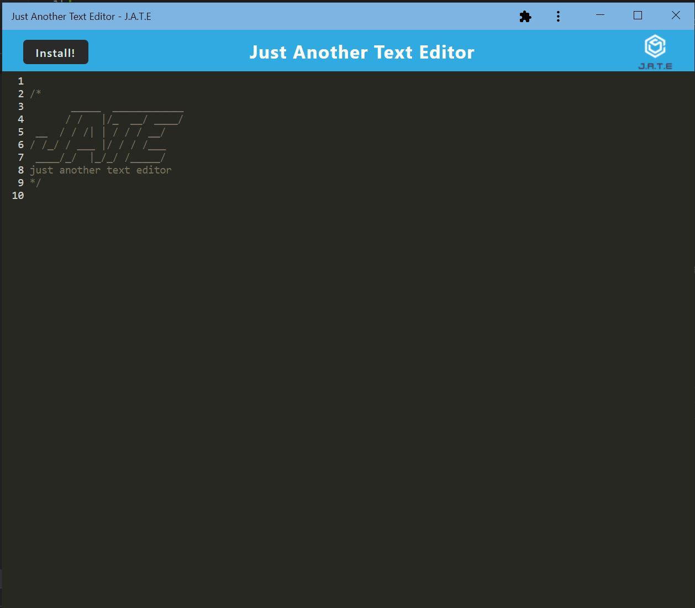

# PWA-Text-Editor

Bootcamp Module 19 Challenge - Building a text editor as a PWA

## Description

- This is a PWA (Progressive Web Application) which functions like a text editor.
- Webpack is used to bundle JavaScript files.
- Caching of static assets makes the appplication fast-loading.
- This application is also usable in an offline environment.
- This web application can be downloaded to your machine.

## Table of content

- [Installation](#installation)
- [Usage](#usage)
- [Credits](#credits)
- [License](#license)

## Installation

- The installation guide is for development purposes.

- Before using the application, in the terminal, navigate to the root foler, type npm install to install the packages.

- After installing the required packages, in the terminal, run the command "npm run start:dev" to start webpack build and to start the local server

## Usage

- Link to the demo video [https://app.castify.com/watch/c4bf2e54-5929-45ce-a43e-d701ed476d15](https://app.castify.com/watch/c4bf2e54-5929-45ce-a43e-d701ed476d15)

- Link to the Github Repository [https://github.com/BranBao1995/PWA-Text-Editor](https://github.com/BranBao1995/PWA-Text-Editor)

- This is a screenshot of the web application when loaded:

  - 

- Service worker registered by the browser upon loading of the application:

  - 

- Caching of assets:

  - 
  - 

- When something is typed into the editor, and the editor goes out of focus, the content will be saved to the database storage named "jate":

  - 

- Click the install button to install the app to your machine:

  - 

- The downloaded can be used when offline and it looks like this:
  - 

## Credits

- Author's Github Profile: [https://github.com/BranBao1995](https://github.com/BranBao1995)

## License 

The MIT License

Copyright (c) [2022] [Hongdong Bao]

Permission is hereby granted, free of charge, to any person obtaining a copy
of this software and associated documentation files (the "Software"), to deal
in the Software without restriction, including without limitation the rights
to use, copy, modify, merge, publish, distribute, sublicense, and/or sell
copies of the Software, and to permit persons to whom the Software is
furnished to do so, subject to the following conditions:

The above copyright notice and this permission notice shall be included in all
copies or substantial portions of the Software.

THE SOFTWARE IS PROVIDED "AS IS", WITHOUT WARRANTY OF ANY KIND, EXPRESS OR
IMPLIED, INCLUDING BUT NOT LIMITED TO THE WARRANTIES OF MERCHANTABILITY,
FITNESS FOR A PARTICULAR PURPOSE AND NONINFRINGEMENT. IN NO EVENT SHALL THE
AUTHORS OR COPYRIGHT HOLDERS BE LIABLE FOR ANY CLAIM, DAMAGES OR OTHER
LIABILITY, WHETHER IN AN ACTION OF CONTRACT, TORT OR OTHERWISE, ARISING FROM,
OUT OF OR IN CONNECTION WITH THE SOFTWARE OR THE USE OR OTHER DEALINGS IN THE
SOFTWARE.
